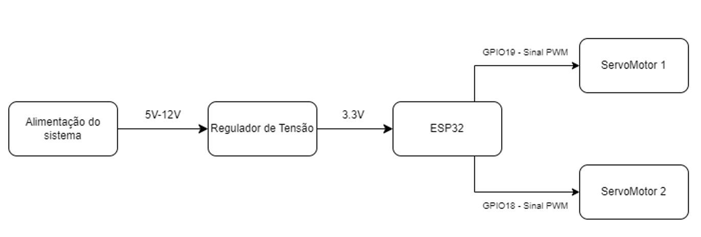
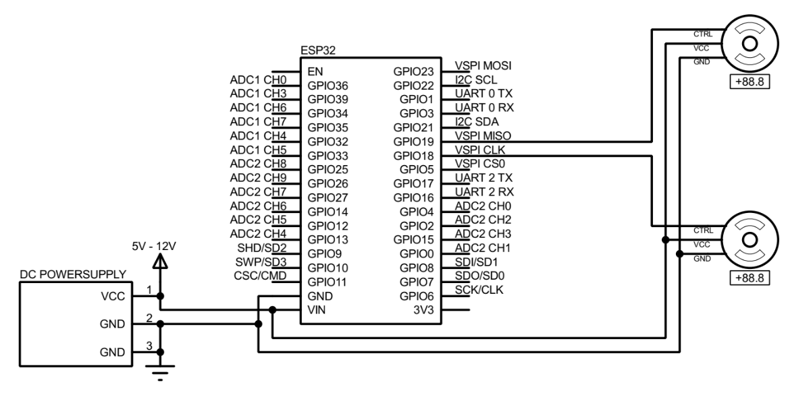
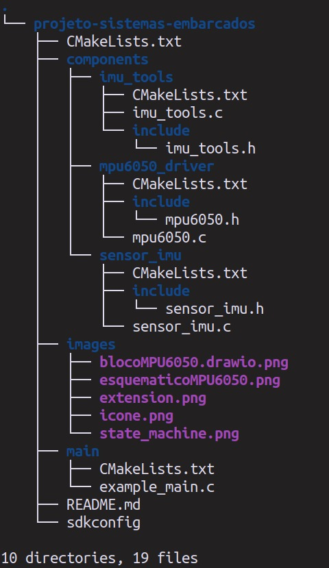
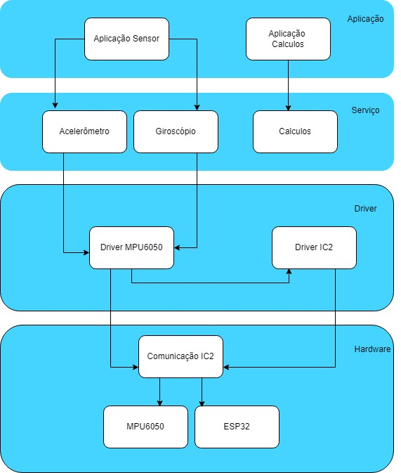
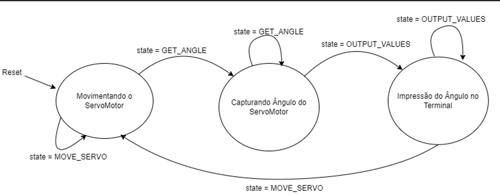
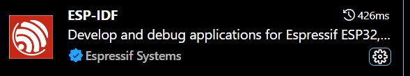
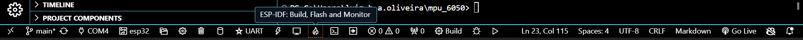

| Placas suportadas | ESP32 | ESP32-C2 | ESP32-C3 | ESP32-C6 | ESP32-H2 | ESP32-S2 | ESP32-S3 |
| ----------------- | ----- | -------- | -------- | -------- | -------- | -------- | -------- |
# Descrição do projeto
Neste repositório foram desenvolvidas duas bibliotecas para utilizar do módulo MPU6050 utilizando das medições do giroscópio e do acelerômetro.

Na biblioteca **sensor_imu** temos a definição dos structs que capturam os dados do giroscópio e do acelerômetro além das seguintes funções:

```
imu_init(): Configura a comunicação I2C e o MPU6050 deixando ele pronto para captura dos dados.

get_acceleration_data(AccelerationData *data): Retorna os dados do acelerômetro nos eixos x, y e z.

get_gyroscope_data(GyroscopeData *data): Retorna os dados do giroscópio nos eixos x, y e z.
```

Na biblioteca **imu_tools** temos as definições dos structs que guardam os dados do sensor, dos quaternions e ângulos de euler e também as seguintes funções:  

```
get_imu_data(IMUData *data): Captura os dados do acelerômetro e do giroscópio e guarda no struc IMUData passado como parâmetro.

calculate_quaternion(const IMUData *data, Quaternion *quaternion): A partir dos dados guardados na estrutura IMUData vai calcular os quatro quaternions.

quaternion_to_euler(const Quaternion *quaternion, EulerAngle *euler): A partir dos dados guardados na estrutura Quaternion vai calcular os três angulos de euler yaw, pitch e roll.

get_quaternion(Quaternion *quaternion): Vai pegar o Quaternion calculado na função calculate_quaternion e gravar no quaternion passado como parâmetro.
```


# Diagrama de blocos
  

# Esquemático


# Árvore de arquivos


# Diagrama de arquitetura


# Video Explicativo
***[Video Explicativo - Entrega 01 - Sistemas Embarcados [Youtube]](https://www.youtube.com/watch?v=z6EThjjiCBM)***

**OBS: Caso sua placa ESP32 utilize outros pinos diferentes do 21 e 22 para o SDA e SCL é importante modificar na função i2c_bus_init dentro da biblioteca sensor_imu.c**

# Máquina de estados


# Como rodar o projeto
Faça o download da extensão abaixo no VSCode
  

Após baixar com sucesso deverá aparecer o menu abaixo daí é só clicar no ícone "ESP-IDF: Build, Flash and Monitor"  




