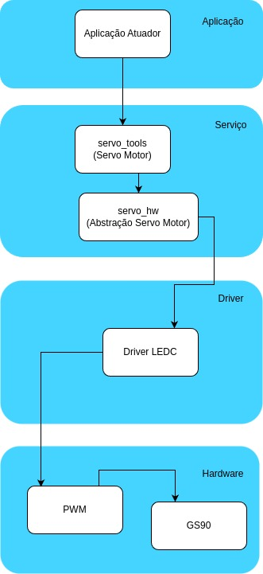

| Placas suportadas | ESP32 | ESP32-C2 | ESP32-C3 | ESP32-C6 | ESP32-H2 | ESP32-S2 | ESP32-S3 |
| ----------------- | ----- | -------- | -------- | -------- | -------- | -------- | -------- |
# Descrição do projeto
Neste repositório foram desenvolvidas duas bibliotecas para controle de servo motores.

A biblioteca **servo_hw** Fornece uma interface de baixo nível para configurar e controlar servos usando ESP32 PWM.

Configuração:  

```
■ ServoConfig: Define parâmetros como ângulo máximo, largura de pulso mínima e máxima, frequência PWM, canal LEDC, ciclo de trabalho e pino do servo.

■ ServoAngle: Armazena o ângulo atual do servo.
```

Funções:
```
■ hw_servo_init(uint8_t gpio_num): Inicializa o servo configurando o PWM no pino especificado.

■ hw_servo_set_pulse_width(uint8_t gpio_num, uint32_t pulse_width_us): Define a largura do pulso PWM para controlar a posição do servo.

■ hw_servo_deinit(uint8_t gpio_num): Desativa o servo e desabilita o PWM no pino especificado.
``` 
A biblioteca **servo_tools** é complementar a biblioteca SERVO_HW com funções adicionais para inicialização e controle de ângulo do servo.

```
■ servo_init(ServoConfig *config): Inicializa o servo usando as configurações especificadas na estrutura ServoConfig.

■ servo_set_angle(ServoConfig *config, ServoAngle angle): Define o ângulo do servo com base na estrutura ServoAngle.

■ servo_get_angle(const ServoConfig *config, ServoAngle *angle): Obtém o ângulo atual do servo e o armazena na estrutura ServoAngle.
```


# Diagrama de blocos
  

# Esquemático


# Diagrama de arquitetura


# Video Explicativo
***[Video Explicativo - Entrega 02 - Sistemas Embarcados [Youtube]](https://www.youtube.com/watch?v=dHcb04kcQVU)***

**OBS: Caso sua placa ESP32 utilize outros pinos diferentes do 21 e 22 para o SDA e SCL é importante modificar na função i2c_bus_init dentro da biblioteca sensor_imu.c**

# Máquina de estados


# Como rodar o projeto
Faça o download da extensão abaixo no VSCode
  

Após baixar com sucesso deverá aparecer o menu abaixo daí é só clicar no ícone "ESP-IDF: Build, Flash and Monitor"  


